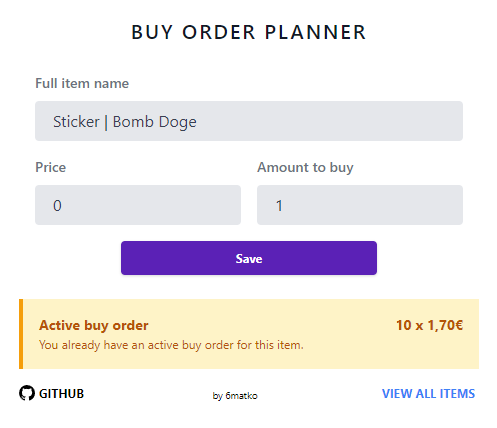
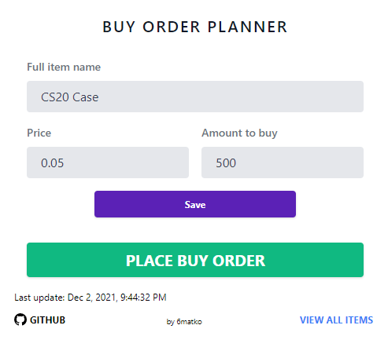

## About

Buy Order Planner is a simple Chrome extension to plan Steam Community Market (SCM) buy orders and quickly place buy order with your planned settings.

_This extension was created to ease the process of buy order creation and give ability to plan buy orders for items that might be listed soon. There was no intention to automate buy order creation process._

## Features

- Plan buy order on any SCM listing page (via popup)
  - Set price & amount to buy at
- View quick information about active buy orders on SCM listing page (via popup)
- View list of all set planned buy orders. Following features available:
  - Filter by item name
  - Remove planned buy order
- Quickly open native "Set buy order" modal (via popup)
  - Price & amount fields will be automatically filled with your values
- Manually add items from any page (via popup)

## Built With

- [Angular](https://angular.io/)
- [Tailwind CSS](https://tailwindcss.com/)

## Some cool libraries used

- [@ngneat/dialog](https://github.com/ngneat/dialog) - Easy to use dialog modals
- [ngx-indexed-db](https://github.com/assuncaocharles/ngx-indexed-db) - Wrapper for IndexedDB

## Other

- This project was generated with [ng-chrome-extension](https://github.com/larscom/ng-chrome-extension). For more info please check its Github page.
- It's a simple pet project without any purpose so don't expect much from it. It can be used as real world example of Angular app and/or Chrome extension built on top of Angular

### If you found a BUG, have a Feature Request or Question, feel free to visit [Issues](https://github.com/6matko/bo-planner/issues)

## Screenshots
#### Active buy order display

#### Planned buy order

